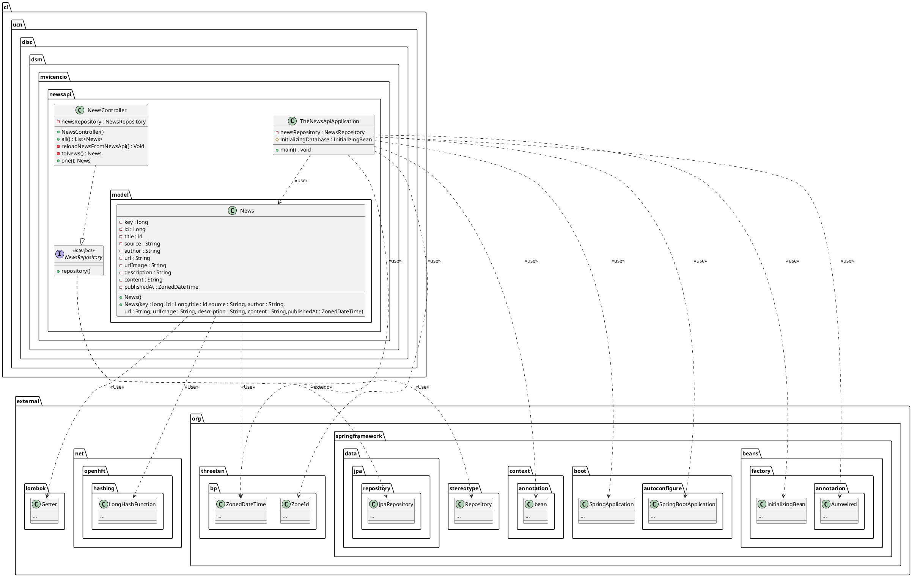

# the News API REST Project

***
(c) 2021 Desarrollo de Solucionnes móviles

## class Model

```puml
@startuml
package external{
    package lombok{
        class Getter{
        ...
        }
    }
    package org.threeten.bp{
        class ZonedDateTime{
        ...
        }
        class ZoneId{
        ...
        }
    }
    package net.openhft.hashing{
        class LongHashFunction{
        ...
        }
    }
    package org.springframework{
        package data.jpa.repository{
            class JpaRepository{
            ...
            }
        }
        package stereotype{
            class Repository{
            ...
            }
        }
        package context.annotation{
            class bean{
                ...
            }
        }
        package boot{
            class SpringApplication{
            ...
            }
            package autoconfigure{
                class SpringBootApplication{
                ...
                }
            }
        }
        package beans.factory{
        class initializingBean{
        ...
        }
        package annotarion{
            class Autowired{
                ...
            }
        }
    }
        
    }
    
    
}
package cl.ucn.disc.dsm.mvicencio.newsapi{
    package model{
        class News{
            - key : long
            - id : Long
            - title : id
            - source : String
            - author : String
            - url : String
            - urlImage : String
            - description : String
            - content : String
            - publishedAt : ZonedDateTime
            + News()
            + News(key : long, id : Long,title : id,source : String, author : String,
             url : String, urlImage : String, description : String, content : String,publishedAt : ZonedDateTime)
        }
        News ..> ZonedDateTime : <<Use>>
        News ..> Getter : <<Use>>
        News ..> LongHashFunction : <<Use>>
    }
    class NewsController{
        - newsRepository : NewsRepository
        + NewsController()
        + all() : List<News>
        - reloadNewsFromNewsApi() : Void
        - toNews() : News 
        + one(): News
    }
    interface NewsRepository <<interface>>{
        + repository()
    }
    NewsController ..|> NewsRepository
    NewsRepository ..> JpaRepository : <<extend>>
    NewsRepository ..> Repository : <<Use>>
    class TheNewsApiApplication{
         - newsRepository : NewsRepository
         + main() : void
         # initializingDatabase : InitializingBean
    }
    TheNewsApiApplication ..> News : <<use>>
    TheNewsApiApplication ..> initializingBean: <<use>>
    TheNewsApiApplication ..> Autowired : <<use>>
    TheNewsApiApplication ..> SpringApplication : <<use>>
    TheNewsApiApplication ..> SpringBootApplication : <<use>>
    TheNewsApiApplication ..> ZoneId : <<use>>
    TheNewsApiApplication ..> ZonedDateTime : <<use>>
    TheNewsApiApplication ..> bean : <<use>>
    
    
}

@enduml
```

## license

[MIT](https://choosealicense/mit/)